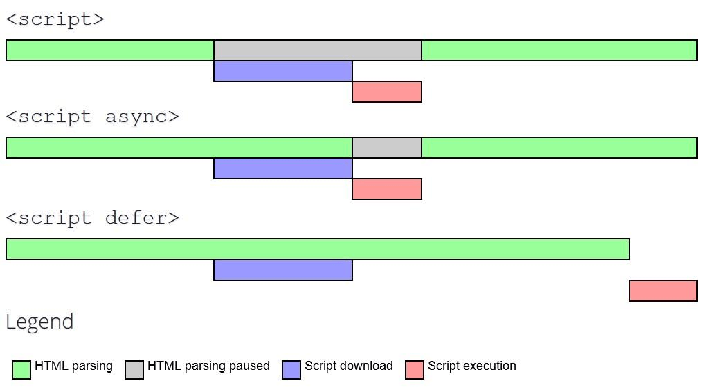

# 網頁生命週期
> `DOMContentLoaded` -> `load` -> `beforeunload` -> `unload`

主要有四個事件
1. `DOMContentLoaded`
  - 瀏覽器已完成下載 HTML，並已建構完成 DOM Tree
  - 此時其他外部資源像是圖片、影片以及 CSS 檔可能還沒下載完成
  - 此時可以對 Node 節點添加監聽事件，並且初始化接口，大部分會在此時添加操作
  - 相似於 jQuery 的 `.ready()` [2]
  - Firefox，Chrome 和 Opera 的自動填充會在 `DOMContentLoaded` 事件中觸發

2. `load`
  - 所有的資源皆以下載完成，包含 圖片、影片以及 CSS
  - 樣式已被套用，而且已知圖片大小

3. `beforeunload`
  - 使用者正要離開，可以詢問使用者是否要離開頁面，例如：未保存的修改

4. `unload`
  - 使用者幾乎已經離開了
  - 但還是可以啟動一些操作，例如：發送分析數據，可以使用一個特殊的方法 `navigator.sendBeacon(url, data)` 在背景發送數據，但不會延遲頁面切換


## DOMContentLoaded 與 Script 的 blocking 與否
當瀏覽器處理一個 HTML 文檔遇到 `script` 標籤時，有分以下幾種狀況

1. `embedded script`
  - 中斷 HTML Parsing，先執行 script，再繼續 HTML Parsing

2. `external script file` without `async` or `defer` attribute
  - 中斷 HTML Parsing，下載 script 檔案，執行 script，再繼續 HTML Parsing

3. `external script file` with `async` attribue
  - 在背景下載 script 檔案，等到檔案下載完成，中斷 HTML Parsing，執行 script，繼續 HTML Parsing

4. `external script file` with `defer` attribue
  - 在背景下載 script 檔案，等到 HTML Parsing 完成後，依各個 defer script 出現順序執行 script





> 補充：使用 `document.createElement('script')` 動態生成 script tag，並添加到網頁並不會 blocking HTML Parsing。


## readyState
有以下三種狀態

- `loading` — 文檔正在下載。
- `interactive` — 文檔已被解析完成，與 `DOMContentLoaded` 幾乎同時發生，但是是在 `DOMContentLoaded` 之前發生。
- `complete` —— 文檔與資源皆已下載完成，與 `window.onload` 幾乎同時發生，但是是在 `window.onload` 之前發生。

```html
<script>
  console.log('initial readyState:' + document.readyState);

  document.addEventListener('readystatechange', () => console.log('readyState: ' + document.readyState));
  document.addEventListener('DOMContentLoaded', () => console.log('DOMContentLoaded'));

  window.onload = () => console.log('window onload');
</script>

<iframe src="iframe.html?speed=1&cache=0" style="visibility:hidden" onload="console.log('iframe onload')"></iframe>


<script>
  img.onload = () => console.log('img onload');
</script>
```

以上腳本執行的先後順序會是
1. [1] initial readyState:loading
2. [2] readyState:interactive
3. [2] DOMContentLoaded
4. [3] iframe onload
5. [4] img onload
6. [4] readyState:complete
7. [4] window onload

> 方括號中標有相同數字的事件幾乎是同時發生的（± 幾毫秒）。其中特別的地方是 `img.onload`（最後一個資源）和 `window.onload` 幾乎同時發生。


## Reference
[1] https://javascript.info/onload-ondomcontentloaded
[2] https://api.jquery.com/ready/
[3] https://medium.com/jspoint/how-the-browser-renders-a-web-page-dom-cssom-and-rendering-df10531c9969
