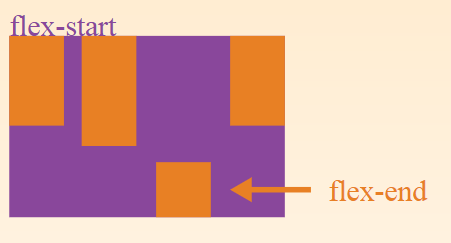

# Flexbox

Merchu Liang, Oct. 18, 2017

>此為參考其他教學整理而成，有些圖片直接截圖，尚未整理完成成自己做的版本，如有版權冒犯會立即移除。特別謝謝參考連結1, 2 的教學，寫得很仔細。

[TOC]

## Introduction

- CSS3 語法
- 為了適應不同螢幕尺寸和顯示設備而產生
- 除了 IE 是部份支援，其他近幾版的瀏覽器(Chrome, Firefox, Safari, Edge...)都支援

> Flexible: 易於改變或被改變的 (able to change or be changed easily according to the situation)
>
> [Bootstrap v4 beta 的 CSS 語法也使用 flex](https://getbootstrap.com/docs/4.0/layout/grid/)

## Architecture

### Flex Container & Flex Item

外面的框給予屬性【display: flex】

- 外面 --> **flex container**
- 裡面的所有物件 --> **flex item(s)** (只有第一層受影響)

### Main Axis & Cross Axis

- Main Axis 通常是水平的
  - main start
  - main end
- Cross Axis 垂直於 Main Axis
  - cross start
  - cross end
- Flex Line (對齊線)
  - 預設只有一條線
  - 可以多條，如果大於 1 條，會跟著 Cross Axis 方向下長

**可以決定**

1. 方向

2. 對齊方式

   

## Properties of The Flex Container

Container 可使用的屬性，指令下在 container 那一層。

### flex-direction

**作用：** 排列方向

**預設值：**row (橫向排列)

**其它常用的設定值：**

- row-reverse (橫向逆向排列)

- column (縱向排列)

- column-reverse (縱向逆向排列)

  

### justify-content

有點像是一般文字排版的置左、置右、置中

**作用：** 處理多餘的空間，順著 Main Axis 的方向

**預設值：**flex-start (從 main start 開始排)

**其它常用的設定值：**

- flex-end

- center

- space-between (多餘的空間平均放在 item 跟 item 之間)

- space-around (多餘的空間分 N(=number of items) 等份，左右兩邊留 N/2 的空間)

  

### align-items

**作用：** 處理多餘的空間，順著 Cross Axis 的方向

**預設值：** flex-start（從 cross start 開始排）

**其它常用的設定值：**

- flex-end

- center

- stretch (items 延展開)

- baseline (以 flex items 的第一行文字的底為基準對齊)

  

### align-content

**作用：** 處理多餘的空間，順著 Cross Axis 的方向

**預設值：**

**其它常用的設定值：**

- flex-start
- flex-end
- center
- space-between (多餘的空間平均放在 item 跟 item 之間)
- space-around (多餘的空間分 N(=number of items) 等份，上下留 N/2 的空間)
- stretch

### flex-wrap

**作用：** 處理空間不夠的問題，順著 Main Axis 的方向

**預設值：**

**其它常用的設定值：**

- nowrap(default) (先擠大家的空間，東西太多會 overflow)

- wrap (由上而下)

- wrap-reverse (由下而上)

  

## Properties of The Flex Items

Item 可使用的屬性，指令下在 item 那一層。

### flex

**作用：**以 item 角度處理空間(多餘/不足)問題

**單位：**number, number, length(em, percentage...) 

**預設值：**0 1 auto (flex-grow, flex-shrink, flex-basis)

- flex-grow: 多餘的寬度空間依有給定值的 item(s) 按比例分配成長，負值無效。

- flex-shrink: 擠不出的寬度空間依有給定值的 item(s) 按比例分配縮小，負值無效。

- flex-basis: 當有多餘的寬度空間時，定義此 item 的寬度，如果是百分比則是以外框的寬度為基準單位。

  

### order

**作用：**將 item 的 order 數值由小到大排列(權重排列)

**單位：**number

**預設值：**0

### align-self

**作用：**設定單一一個 flex item 對於 cross axis 的對齊方式 (可以與 **align-items** 對照)

**預設值：**auto

**其它常用的設定值：**

- flex-start
- flex-end
- center
- stretch (items 延展開)
- baseline (以 flex items 的第一行文字的底為基準對齊)
  

## Reference

[1] 網頁基礎15天: https://www.everyonecanwebsite.com/blog/post/flexbox-basic

[2] CSS-TRICKS: https://css-tricks.com/snippets/css/a-guide-to-flexbox/

[3] MDN Web Docs: https://developer.mozilla.org/en-US/docs/Web/CSS/CSS_Flexible_Box_Layout

[4] Flexbox Playground: https://demos.scotch.io/visual-guide-to-css3-flexbox-flexbox-playground/demos/

[5] Practice Game - Froggy: http://flexboxfroggy.com 