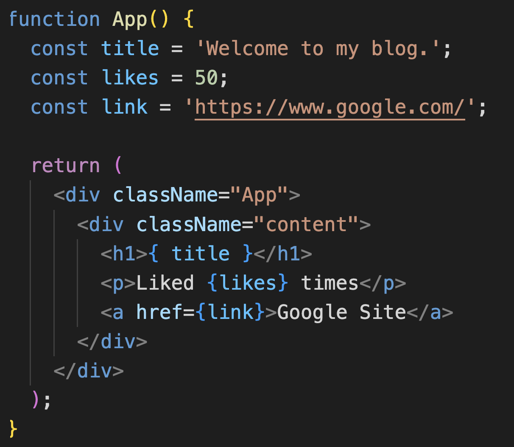

# Basic

## Intro (#1 ~ #3)
### VSCode
- 可以下載 extension `Simple React Snippets` (Burke)
- setting 的 `Emmet` > `Include Languages` 新增 `{ javascript: javascriptreact }`
- `React` uses `className` over `class` attribute

### Chrome Extension
- React Developer Tools
- Redux DevTools


## Dynamic Value (#4)
- 

- ```html
  <p>{ 10 }</p>
  <p>{ 'hello world' }</p>
  <!-- 下方的 array 會顯示成 12345 -->
  <p>{ [1, 2, 3, 4, 5] }</p>
  <p>{ Math.random() * 10 }</p>
  ```

- Objects (key value objects) are not valid as a React child


## Reference
[1] https://www.youtube.com/playlist?list=PL4cUxeGkcC9gZD-Tvwfod2gaISzfRiP9d